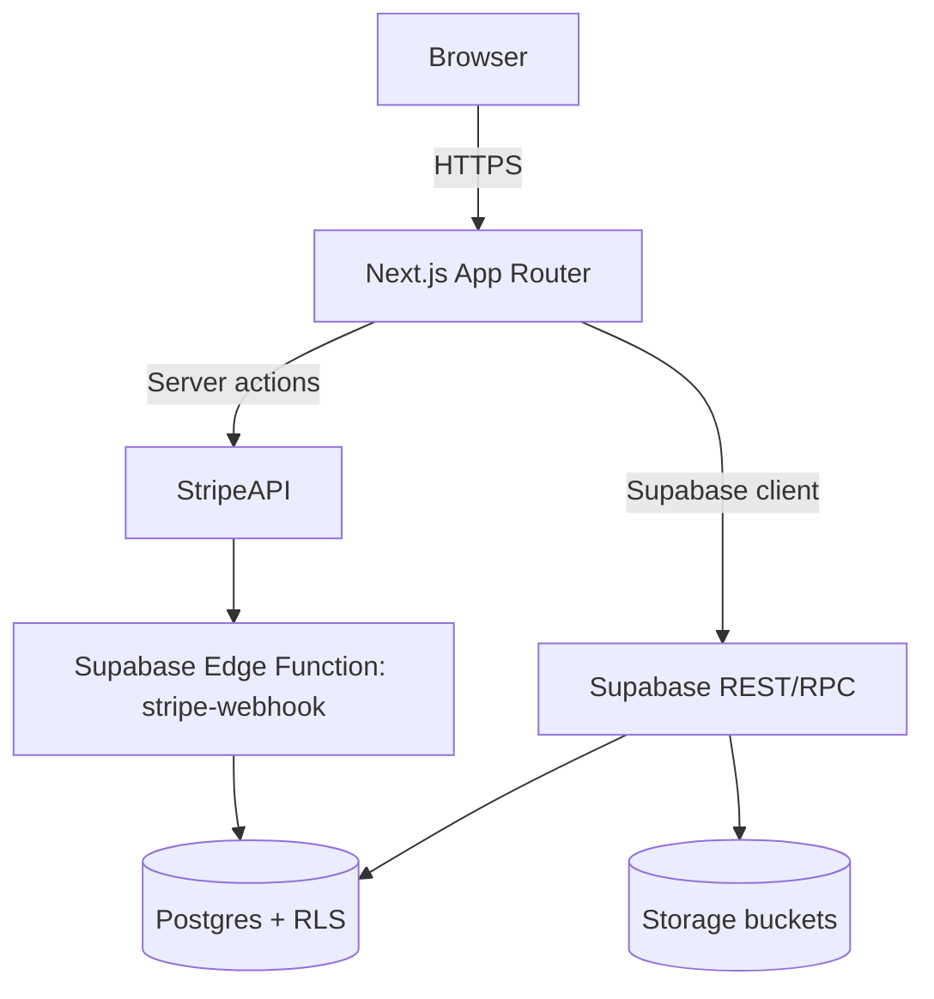

# Architecture

## Modules
- `apps/web`: Next.js application with App Router routes under `app/(routes)`.
- `packages/ui`: shared UI primitives (buttons, tokens).
- `supabase`: database schema, policies, functions, triggers, edge functions.
- `tests`: Playwright end-to-end and Vitest unit tests.

## Data flow
1. Server components fetch data via Supabase service role using cookies for auth context.
2. Client components call server actions (e.g., donations, volunteer form) for secure mutations.
3. Stripe checkout session writes an intent row; webhook marks status as completed via RPC.
4. Storage assets served via signed URLs with owner-scoped policies.

## Security
- Row Level Security on every table with least privilege policies.
- Strict headers via `next-secure-headers`.
- Input validation using Zod in server actions and API routes.
- Stripe webhook verified with signed secret inside Edge Function.
